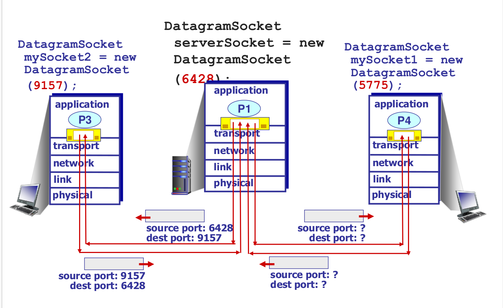

# 3.10 Ch3-1 传输层

---

## 运输层服务

- 运输层协议为运行在不同主机上的应用进程之间提供了**逻辑通信**功能。
- 运输层协议在端系统中而不是路由器实现。
  - 在接收端，网络层从数据报中提取运输层报文段，并将该报文段向上交给运输层。
  - 在发送端，运输层将从发送应用程序进程接收到的报文转换成运输层分组。
  - ◼ Send side: breaks app messages
    into segments, passes to network
    layer
    ◼ Receive side: reassembles
    segments into messages, passes
    to app layer
- TCP 和 UDP

---

## 为什么要运输层？

- IP数据报是发往主机的，但是端到端的通信是在主机上的应用程序进程进行的
  - 需要一个方式去确定哪个数据报送往哪个应用程序进程
- IP只提供了一个脆弱的服务模型（尽力而为）
  - 数据包可能会被损坏、延迟、丢失、重新排序或重复
  - 对于要发送多少流量以及何时发送没有指导
  - 应用程序开发人员处理这些问题很繁琐

运输层作用：

- 进程间交流

  - 应用进程的复用和分解

  - 用ports来实现

- 为应用层提供常见的端到端服务 [可选]

  - 可靠的、有序的数据传输
  - 适度的数据传输速度，过快可能会使网络不堪重负，过慢则效率低下

- TCP和UDP最为常见，但不是全部

  - UDP是最简化的传输层协议，只提供复用和分解功能
  - TCP提供了一种可靠、有序的字节流抽象，有拥塞控制，但没有性能保证（延迟、b/w等）

---

## 多路复用和多路分解

多路复用：在源主机从不同套接字中收集数据块，并为每个数据块封装上首部信息（这将在以后用于分解）从而生成报文段，然后将报文段传递到网络层

多路分解：每个运输层报文段中具有几个字段。在接收端，运输层检查这些字段，表示出接收套接字，进而将报文段定向到该套接字。将运输层报文段中的数据交付到正确的套接字的工作称为多路分解。

多路分解流程：主机接收IP数据报，每个数据报都有源IP地址、目标IP地址，每个数据报携带一个传输层段，每个段都有源、目标端口号，主机使用IP地址和端口号将段定向到适当的套接字

### 无连接的多路复用和分解（UDP）

### 面向连接的多路复用和分解（TCP）

多线程的分配

---

## Socket

应用程序进程与操作系统（传输层）交换网络消息的软件抽象

传输层寻址：<HostIP, Port>

UDP socket: TYPE is SOCK_DGRAM
TCP socket: TYPE is SOCK_STREAM

---

## Ports

- 16位数字帮助分辨apps
  - 数据包在传输头中携带src/dst端口号
  - Well-known (0-1023) and ephemeral ports
- 操作系统存储套接字和端口之间的映射

---

## 可靠数据传输（重要，必考）

数据包可能会被损坏、延迟、丢失、重新排序或重复

应对机制：

- 校验和：检测损坏
- ACK：接收者告诉发出者它收到了数据包
- NACK：告诉发出者没收到
- 序列号：一种识别数据包的方法
- 重传：发送方重新发送数据包
- 超时：决定何时重新发送的一种方法
- 前向纠错：一种掩盖错误的方法
- 网络编码：一种修复错误的有效方法

如果ACK/NACK损坏？Data and ACK packets carry sequence numbers

定时器驱动的丢失检测:发送数据包时设置计时器；超时时重新传输,但定时器驱动的重传可能会导致重复

---

## 可靠数据传输协议

1. Stop and wait(inefficient!)

流水线：发送方允许多个“正在进行中”但尚未确认的数据包

- 必须增加序列号的范围
- 在发送方和/或接收方进行缓冲

---

## 三种方案

### Sliding Window(重要！必考！)

Window=相邻序列号集
集合的大小是窗口大小；假设窗口大小为n
总体思路：一次最多发送n个数据包，发送方可以在其窗口中发送数据包， 可接受的数据包窗口在成功接收/确认时“滑动”， 窗口包含可能仍在传输中的所有数据包

过程示例：

If window size is n, then throughput is roughly
**MIN(n*DATA/RTT, Link Bandwidth)***
Compare to Stop and Wait: Data/RTT

### ---

## 对ACK返回的处理

累积ACK ：ACK携带接收方期望的下一个顺序序列号

选择性ACK：ACK单独确认正确接收的数据包（更智能，但实现更复杂）

---

## 滑动窗口协议

- Go-Back-N(GBN)
- Selective Repeat(SP)

### GBN

- 发送方最多传输n个未确认的数据包
- Receiver只按顺序接受数据包
- 丢弃乱序数据包（即B+1以外的数据包）
- Receiver使用累积确认，即ACK中的序列#=顺序顺序中的下一个预期序列#
- Sender为第一个未完成的数据包设置计时器（A+1），如果超时，重新传输A+1，…，A+n

有错误/无错误示例

### SR

- 发送方：最多传输n个未确认的数据包

- 假设数据包k丢失，k+1不丢失

  - Receiver: indicates packet k+1 correctly received
  - Sender: retransmit only packet k on timeout
  - 重传效率高，但实现复杂，每个数据包都需要一个计时器

  

  ---

  

  ### When would GBN be better?

  When error rate is low; wastes bandwidth otherwise

  ### When would SR be better?

  When error rate is high; otherwise, too complex

  ### 总结

  使用滑动窗口，只要窗口大小足够大，就可以充分利用链接。
  ◼ 发送方必须缓冲所有未确认的数据包，因为它们可能需要重新传输
  ◼ 接收器可能能够接受乱序数据包，但仅限于其缓冲区限制
  ◼ 实现复杂性取决于协议细节（GBN与SR）

  

  
