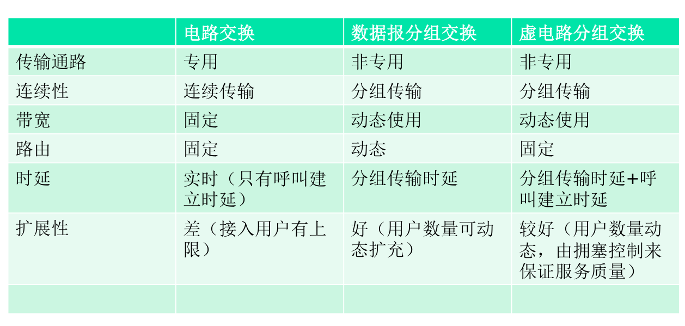
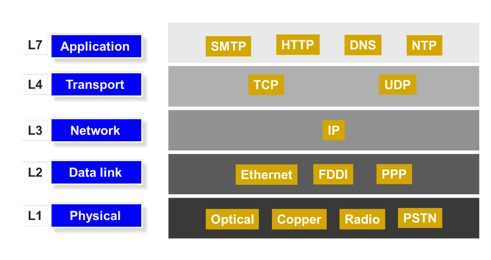
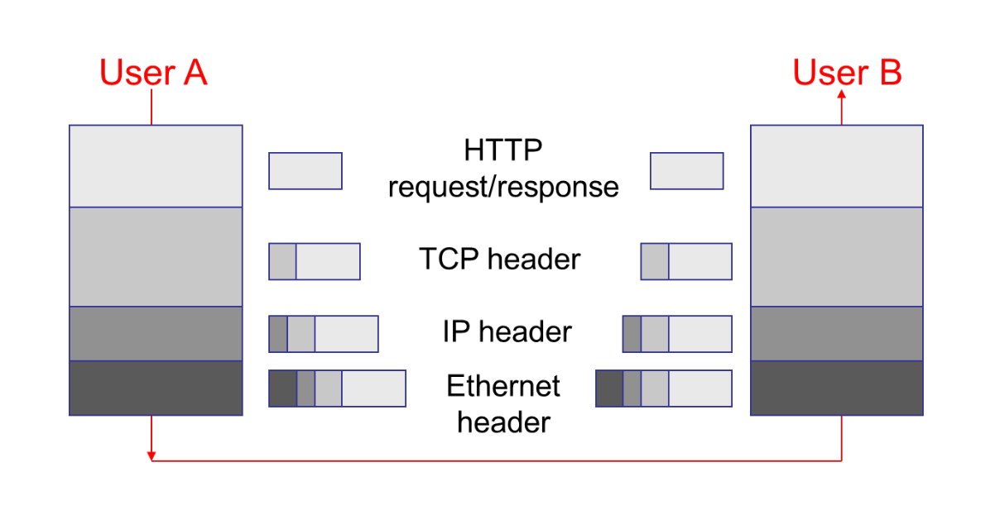
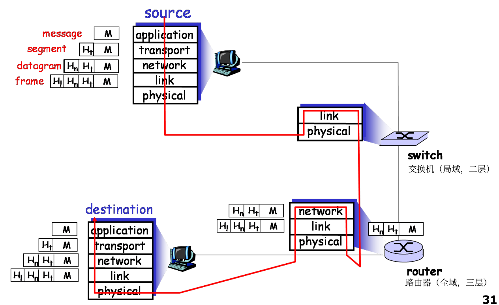
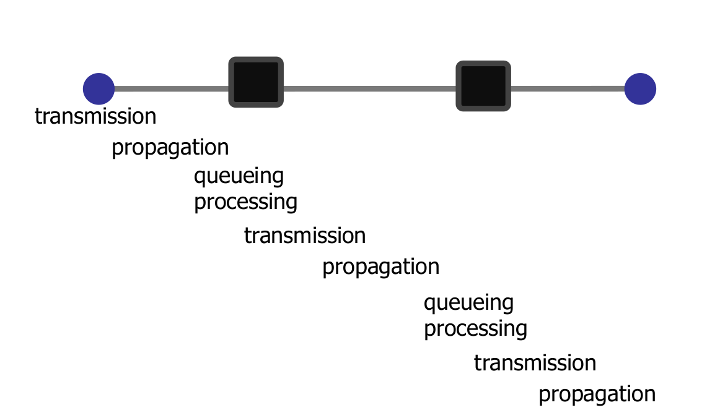
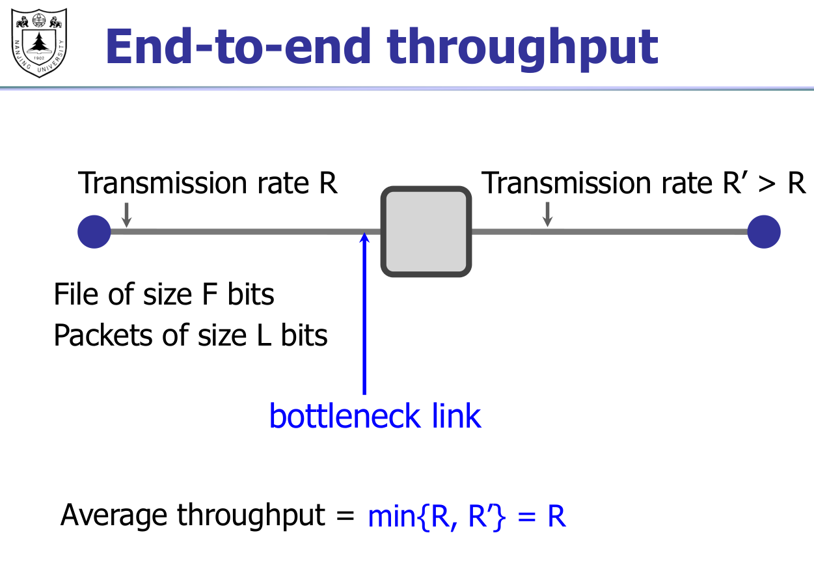

# 2.19计网

分组交换，电路交换，混合（虚电路）

---

## 分组交换

各种网络应用中端系统彼此交换**报文**，为了从源端向目的端发送一个报文，源将长报文划分为较小的数据块，称之为**分组**。

每个分组都通过通信链路和**分组交换机**传送。

交换机有两类：**路由器，链路层交换机**

分组交换：数据被分割成分组，每个分组携带目的地址

#### 存储转发传输

在交换机能够开始向输出链路传输该分组的第一个bit前，必须接收到整个分组。（先缓存）

比如，路由器在转发前需要接受，存储和处理整个分组。

e.g.通过由N条速率均为R的链路组成的路径（即N-1个路由器）发送一个分组，端到端时延是NL/R，其他例子详见P17.

#### 排队时延和分组丢失（丢包）

每台分组交换机有多条链路进行相连，每条链路有一个**输出缓存（输出队列）**，因此可能有**存储转发时延**，即某链路正忙于传输其他分组，到达分组必须在输出缓存等待。

**排队时延**：输出缓存里等待其他缓存里的分组被传输

**分组丢失（丢包）**：缓存空间被占满了，只能丢弃

#### 转发表和路由选择协议

统计多路复用：按需使用资源

路由器为每个分组独立地确定转发路径

---

### 电路交换

- 每个呼叫使用自己的专用电路

- 事先建立连接，传输路径固定

- 资源独占，有性能保证

- 电话网络

  区别，优劣势见上图
  对于频分复用（FDM），每条电路连续地得到部分带宽。对于时分复用（TDM），每条电路在短时间间隔（即时隙）中周期性地得到所有带宽

---
### 电路交换和分组交换区别

1.在电路交换网络中，在端系统间通信会话期间，预留了端系统间沿路径通信所需要的资源（缓存，链路传输速率）；在分组交换网络中，这些资源则不是预留的，会话的报文按需使用这些资源，其结果是不等不排队接入通信线路。

2.分组交换不适合实时服务，因为它的端到端时延是可变的和不可预测的（主要是由于排队时延的变动和不可预测所致）；但是分组交换提供了比电路交换更好的带宽共享，且比电路交换更简单，更有效，实现成本更低。

---

## Internet history(没用)

60年代：诞生分组交换网络

70年代：成型 单一封闭网络->开放互联网络

80年代： 新协议TCP/IP，DNS实现域名解析 应用：Email,Ftp

90年代：万维网，商用化，新型应用

2000：多媒体，P2P网络，社交网络

---

## 协议分层和服务模型

### 分层的体系结构：a series of steps

各层的所有协议被称为协议栈。

Two standards:

- OSI （Open systems interconnection）Reference model(国际标准，但是不广泛)：7层ISO
- TCP/IP protocol suite(most widely used，行业标准)

---

OSI layers

---

### 5层Internet协议栈

#### 1.应用层

应用层是网络应用程序及它们的应用层协议存留的地方。

包含很多协议，如HTTP（提供了web文档的请求和传送），SMTP（提供电子邮件报文的传输），FTP（提供两个端系统之间的文件传送），DNS（域名系统）

应用层协议分布在多个端系统上，一个端系统中的应用程序使用协议与另一个端系统中的应用程序交换信息分组，这种位于应用层的信息分组称为**报文**(message)。

---

#### 2.运输（传输）层

因特网的运输层在应用程序端点传送应用层报文。

协议：TCP，UDP

运输层的分组称为**报文段**(segment)。

---

#### 3.网络层（不同主机通信）

因特网的网络层负责将称为**数据报（datagram）**的网络层分组从一台主机移动到另一台主机。在一台源主机中的因特网运输层协议向网络层递交运输层报文段和目的地址。

协议：IP，定义了在数据报中的各个字段以及端系统和路由器如何作用于这些字段。IP仅有一个，所有具有网络层的因特网组件必须运行IP。

尽管网络层包括了网际协议和一些路由选择协议，但通常简单称为IP层。

---

#### 4.链路层（相邻节点的通信）

为了将分组从一个节点（主机或路由器）移动到路径上的下一个节点，网络层必须依靠链路层的服务。

在每个节点，网络层将数据报下传给链路层，链路层沿着路径将数据报传递给下一个节点，在该下一个节点，链路层将数据报上传给网络层。

协议：xxx

链路层分组称为**帧**（frame）。

---

#### 5.物理层

虽然链路层的任务是将整个帧从一个网络元素移动到邻近的网络元素，而物理层的任务是将该帧中的一个个bit从一个节点移动到另一个节点。

这层的协议仍然是链路相关的，并且进一步与实际传输媒体相关。

---

### Protocols at different levels

---

### 分层的封装：Protocol headers

---

主机，路由器和链路层交换机，每个包含了不同的层，反映了它们的功能差异。

---

### How to evaluate the performance of a network?(分组交换)

### 1.时延（重点要考）

- Transmission delay 传输时延

  假定分组以先到先服务方式传输，用Lbit表示该分组的长度，用Rbps(b/s)表示从路由器A到路由器B的链路传输速率，传输时延是L/R。

  传输时延是数据帧从发送节点进入传输介质所需的时间，即路由器推出分组所需要的时间，是分组长度和链路传输速率的函数，与两台路由器之间的距离无关。（送过来整个分组多快）

  传输时延通常在ms到us量级。

- Propagation delay 传播时延

  一旦一个bit被推向链路，该bit需要向路由器B传播。从该链路的起点到路由器B传播所需要的时间是传播时延。

  该bit以该链路的传播速率传播，传播时延=两台路由器之间距离除以传播速率。

  传播时延是一个bit从一台路由器传播到另一台路由器所需要的时间，是两台路由器之间距离的函数，与分组长度或链路传输速率无关。(传多快)

  广域网中为ms量级。

- Queuing delay 排队时延

  在队列中，当分组在链路上等待传输时，它经受排队时延。

  一个特定分组的排队时延长度取决于先期到达的正在排队等待向链路传输的分组数量。

  ms到us量级

- Processing delay （节点）处理时延

  检查分组首部和决定将该分组导向何处所需要的时间是处理时延的一部分。
  
  处理时延也可以包括其他因素，如检查Bit级别的差错所需要的时间。
  
  一般可忽略
  
  ---
  
  
  
  前两个是链路（静态）的，后两个是流量（动态）的，总体累加起来是节点总时延
  
  #### 关于排队时延的其他讨论
  
  1.一个分组要等多长时间发送取决于traffic pattern:出队列速率（恒定），到来分组是阵发/突发的吗？出链路的传输速率
  
  2.数据指标化：排队时延均值，方差，预测阈值
  
  3.Little's Law
  
  - Arrival process: how packets arrive
    - Average rate A
    - Peak rate P
  - W: average time packets wait in the queue(Waiting time)
  - L: average number of packets waiting in the
    queue(Length of queue)
  - L=AxW
  - Compute L: count packets in queue every
    second
  - Easy to compute L, harder to compute W
  
  ---
  
  ### 端到端时延 
  
  

---

### 2.丢包

分组丢失的比例随着流量强度增加而增加，因此一个节点的性能常常不仅根据时延来度量，而且根据丢包的概率来度量。

---

### 3.吞吐量(throughput)

定义:发送端和接收端间单位t传输的数据量

考虑从主机A到主机B跨越计算机网络传送一个大文件，在任何时间瞬间的**瞬时吞吐量**是主机B接收到该文件的速率（以bps计）。

如果该文件由Fbit组成，主机B接收到所有Fbit用去T秒，则文件传送的**平均吞吐量**是F/Tbps。

注意：对于简单的两链路网络，其吞吐量是**瓶颈链路**的传输速率。

---

1 byte=8bit注意
