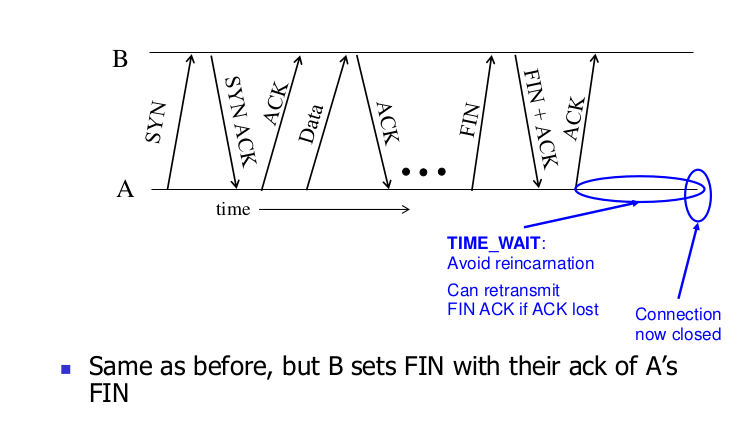

# Ch3-2 TCP,UDP概述

## UDP：user datagram protocol

- 轻量级的进程间通信（避免延迟，不可靠）
- RFC 768（Dip，Dport）
- 尽力而为的传输，可能丢包或被接收端溢出遗弃
- Connectionless（没有握手，每个UDP报文独立处理）
- 用于流媒体（loss tolerant,rate sensitive)，DNS,SNMP,游戏

### UDP报文格式

首部4个字段，每个字段两个字节（16bit）

sport:0-65535    dport: 0-65535  

length:最小值为8字节（只有报头）

checksum除了header+data（有效载荷）还包括了IP首部的一些字段(伪首部)

伪首部不参与实际传输，仅用于校验和计算。

### UDP checksum

16bit相加，如果加法有溢出需要被回卷（加回第一位），最后再取反得到checksum（显然接收方再4个16bit字（包括检验和）checksum结果应该是全1,否则就有差错）

校验和字段=0表示不验证校验和

sport有时候也有用

端到端原则：如果无法保证链路的可靠性，又无法确保内存中的差错检测的情况下，如果端到端数据传输服务要提供差错检测，UDP就必须再端到端基础上在运输层提供差错检测。

---

## TCP:Transmission control protocol

可靠，有序，字节流

可靠：TCP递归地发送丢包，直到放弃并断开连接

有序：TCP只将连续的数据块交给应用程序

字节流：TCP假设有传入的数据流，并尝试将其传递给应用程序

TCP有的：

校验和
序列号是字节偏移量
发送方和接收方保持滑动窗口
接收方发送累积确认（如GBN），发送方维护一个重传定时器
接收器缓冲乱序数据包（如SR）
更多：快速重传、超时估计算法等

### TCP报头（*）

TCP首部一般是20字节，比UDP多12字节

- 源端口号和目的端口号：用于多路复用/分解来自或送到上层应用的数据
- 检验和字段：通过伪首部和Data计算
- 序号字段（32bit）：TCP把数据看成一个无结构的，有序的字节流，一个报文段的序号是该报文段首字节的字节流编号。
  - 比如数据流由一个500000字节的文件组成，MSS（max segment size）为1000字节，数据流首字节编号为0,TCP将为数据流构建500个报文段，第一个报文段分配序号0,第二个1000,以此类推，每个序号被填入到相应TCP报文段首部的序号字段中。
  - 报文段被发送仅当大小达到MSS或者times out超时。
- HdrLen:首部长度字段（4bit）,指示了以32Bit的字为单位的首部长度（通常TCP报文的选项字段为空，所以一般HdrLen=5,即20字节）
- Flags:SYN,FIN,ACK,RST,PSH,URG
  - 三次握手时SYN->SYN|ACK->ACK

#### IP和TCP的报文合作

### 序号和希望ACK传回的序号（确认号）的双向关系

确认号：

- TCP是全双工的，A向B发送数据时也许也接收来自B的数据（都是同一条TCP连接的一部分）。
- 主机A填充进报文段的确认号是主机A期望从主机B收到的下一字节的序号。
- 由于TCP只确认该流中至第一个丢失字节为止的字节，因此TCP被称为提供累积确认。

丢包时的确认号

方案：重复ACK，快速重传

冗余ACK：TCP是GBN和SR的结合

快速重传机制：

收到ACK，具有ACK字段值y

if(y>sendbase){

sendbase=y;

if(当前仍无任何应答报文段)

启动定时器；//singel transmission timer

}

else//对已经确认的报文段的一个冗余ACK

y->冗余ACK++;

if(y->冗余ACK==3)

快速重传这个序号y报文段

### 超时重传

timerout 过长->inefficient   过短(<RTT)->重复发包

解决方案：使超时和RTT成比例

#### 估计往返时间

问题：模糊估计

两种方法：

1.超时间隔加倍

2.测量RTT变化，加上余量，设置和管理重传间隔（RTO或者timeoutinterval）

---

## TCP连接建立（使用flag段）

问题1.slipped data segment

解决方法：ISN（initial sequence number）

问题2：被废弃的SYN被当成新连接了

解决方法：三次握手而不是两次，多一次ACK

SYN丢了怎么办？没有SYN|ACK，sender定时器时间到了重传（定时器不知道设置多长，默认3s(RFCs 1122 & 2988)或6s）

#### 和web的联动

## 挥手

### 1.单包

### 2.双包

### 3.突然终止

### 总结：lifestyle

