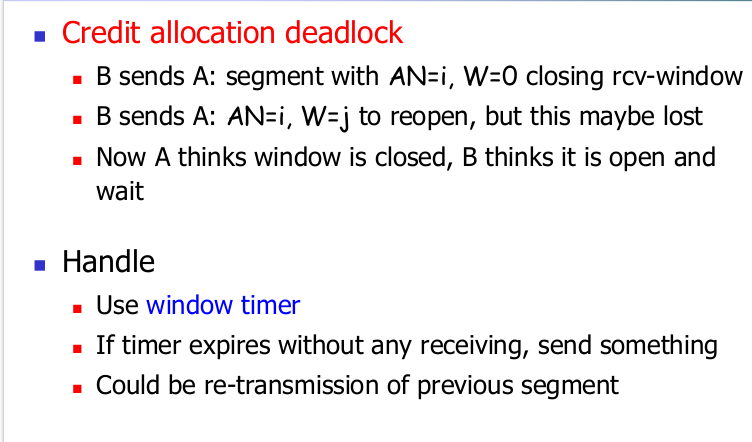
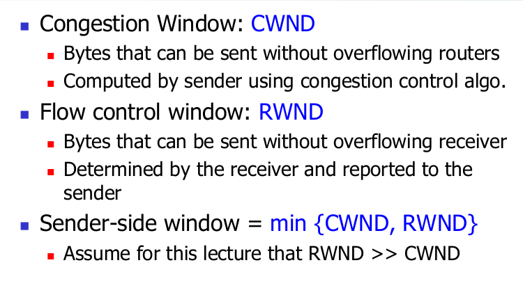

# 

Ch3-3 TCP流量控制，拥塞控制

## TCP流量控制

TCP header的接收窗口（Advertised window）段

### 滑动窗口

### at sender

### at receiver

对于可靠数据传输，fixed sliding window很可靠，但是一旦有丢包，就无法判断是丢了ACK还是流量控制的receiver停发了(满了)。

解决方案：信贷方案

- 接收者使用“广告窗口”（RWND）宣传空余空间（信用额度），以防止发送者溢出其窗口。
  - 接收器在ACK中指示RWND的值
  - 发送方确保传输中的总字节数<=RWND

### 计算方式

### Window更新逻辑

这样将流量控制和ACK解耦，每个8位字节都有一个序列号，每个报文段都有序列号，确认号，窗口大小。

---

### 具体机制和问题

还有可能是B缓存满后没有任何数据要发送给A，这时候要求当B的接收窗口为0时A继续发送一个只有一个字节数据的报文段，这个报文段将会被接收方确认，最终缓存将开始清空，并且确认报文中将包含一个非0的rwnd值。

---

## TCP拥塞控制

### 考虑因素

 Sending host->Buffer in router ->Receiving host(Ignore internal structure of router and model it as a single queue for a particular input-output pair)

Discovering available bandwidth: 选择发送速率以匹配瓶颈带宽

- 没有任何先验知识
- 可以是千兆链路，也可以是调制解调器

Adjusting to variations in bandwidth: 调整速率以匹配瞬时带宽

(实际的网络层十分复杂)

## TCP的方法：端到端的拥塞控制

### CWND与RWND（*）

注：为简化描述，讨论CWND在MSS划分的组中，但是实际情况维护CWND是按bytes维护的。

---

### 拥塞检测

不是所有的丢包都是一样的：重复ACK，超时，需要不同处理

### **ACK确认号的跟踪机制**

- **已确认的最高序列号（`snd_una`）**：
  - 发送方维护一个变量`发送未确认起始号（snd_una）`，表示**最早未被确认的数据字节的序列号**。
  - 例如，若发送方发送了序列号`100-199`的数据，且收到ACK`150`，则`snd_una`更新为`150`，表示数据`100-149`已被确认。
- **新ACK的判断逻辑**：
  - 当收到一个ACK时，发送方比较其确认号与`snd_una`：
    - **确认号 > snd_una**：这是一个**新ACK**，更新`snd_una`为新的确认号，并触发新的数据传输或窗口增长。
    - **确认号 ≤ snd_una**：这是一个**重复ACK**（dupACK）。

**注意：慢启动和拥塞避免收到dupACK都不会使CWND增长！！！**

---

### 速率调整：慢启动，快速恢复，拥塞避免

### 慢启动过程

- CWND的值以一个MSS开始，每当传输的报文段首次被确认就增加一个MSS（所以最初传输速率是MSS/RTT）。
- 这使得CWND和传输速率都指数增长，直到一个由超时指示的丢包事件。

#### 什么时候停止？

- 慢启动为可用带宽提供估计
- 慢启动阈值ssthresh
  - 初始化为一个很大的值
  - 如果遇到由超时指示的丢包，TCP发送方将CWND设置为1并重新开始慢启动（为了完全不丢包），并将ssthresh设置为前一个CWND/2。
  - 当CWND的值等于ssthresh时，结束慢启动并且TCP转移到拥塞避免模式
- 如果检测到3个冗余ACK，TCP执行快速重传，并进入快速恢复状态。

---

## TCP拥塞避免：加性增，乘性减（AIMD）

### 加性增：当CWND>ssthresh

- 对每个ACK，CWND=CWND+1/CWND
- 因此只有收到所有CWND的报文段的确认后，CWND才会加一个MSS

### 乘性减：分类讨论

- 3个重复ACK（丢包事件）
  - ssthresh=CWND/2
  - CWND=ssthresh
  - 进入快速恢复状态
    - 对于引起TCP进入快速恢复状态的缺失报文段，对收到的每个冗余ACK，cwnd的值增加一个MSS（先+3，然后一直重传这个丢失的数据包线性加）
    - 最后当对丢失报文段的一个新ACK到达时（强行优先传过去），TCP在降低CWND（CWND=ssthresh）后进入拥塞避免状态
    - 如果出现超时，类似拥塞避免的ssthresh和CWND改动后，进入慢启动状态
    - 如果出现丢包，CWND=1,ssthresh=CWND/2
- 超时
  - ssthresh=CWND/2
  - CWND=1
  - 进入慢启动状态

快速恢复在TCP早期版本TCP Tahoe版本并非必须组件，它无论丢包还是超时都将拥塞窗口调至1（然后慢启动）。如今的TCP Reno则综合了快速恢复。

Tahoe版本的拥塞窗口

两个版本都会有的CWND图

Reno算法问题：多个报文同时丢失会出现性能问题，系统会多次执行快速重传和快速恢复，多次降低CWND的值，降低传输效率，导致超时。

New Reno算法：只有一个数据包丢失的情况下其机制和Reno一样，但Reno快速恢复算法中发送方收到一个新的ACK就退出快速恢复状态，New Reno只有当所有报文都被应答后才退出快速恢复状态。

两个概念：部分应答（PACK）、恢复应答（RACK）

记TCP发送端恢复阶段中接收到的ACK报文（非冗余ACK）为ACKx，记在接收到ACKx时TCP终端已发出的序列号（SN）最大的报文是PKTy，如果ACKx不是PKTy的应答报文，则称报文ACKx为部分应答（Partial ACK，简称PACK）；若ACKx恰好是PKTy的应答报文则称报文ACKx为恢复应答（Recovery ACK，简称RACK）。

举例来理解：

    如果4、5、6号包丢了，现在只重传4，只收到了4的ACK，后面的5、6没有确认，这就是部分应答Partial ACK。如果收到了6的ACK，则是恢复应答Recovery ACK。

TCP发送端接收到恢复应答表明：经过重传，TCP终端发送的所有报文都已经被接收端正确接收，网络已经从拥塞中恢复。

NewReno发送端在收到第一个Partial ACK时，并不会立即结束Fast-recovery，而会持续地重送Partial ACK之后的数据包，直到将所有遗失的数据包重送后才结束Fast-recovery。收到一个Partial ACK时，重传定时器就复位。这使得NewReno的发送端在网络有大量数据包遗失时不需等待Timeout就能更正此错误，减少大量数据包遗失对传输效果造成的影响。

NewReno大约每一个RTT时间可重传一个丢失的数据包，如果一个发送窗口有M个数据包丢失，TCP NewReno的快速恢复阶段将持续M个RTT。

改进的快速恢复算法具体步骤：
重新定义恢复阶段
进入恢复阶段后，发送端重传被认定为丢失的报文，设置慢启动阈值（ssthresh）和拥塞窗口大小（cwnd）。ssthresh = cwnd/2，cwnd = ssthresh + 3MSS。
收到一个重复ACK，cwnd=cwnd+MSS。
当收到PACK（部分应答）时，发送端重传PACK所确认报文的下一个报文，如果拥塞窗口允许，继续发送新的数据包。
当收到RACK（确认应答）时，发送端认为拥塞中所有被丢弃的报文都已经被重传，拥塞结束，设置cwnd=ssthresh并退出快速恢复状态。

快速恢复是基于数据包守恒的原则，即同一时刻能在网络中传输的数据包是恒定的，只有当旧数据包离开网络后，才能发送新数据包进入网络。一个重复ACK不仅意味着有一个包丢失了，还表示有发送的数据包离开了网络，已经在接收区的缓冲区中，不再占用网络资源，于是将拥塞窗口加一个数据包大小。

Reno和NewReno算法仍存在的问题？
    虽然NewReno可以解决大量数据包遗失的问题，但是NewReno在每个RTT时间只能一个数据包遗失的错误。为了更有效地处理大量数据包遗失的问题，另一个解决方法就是让传送端知道哪些已经被接收端收到，但用此方法必须同时修改传送端和接收端的传送机制。

缺乏SACK算法时发送端只能选择两种恢复策略：
每一个RTT时间内至多重传一个丢弃的包  (Reno和New Reno)
重传所有包，其中包括可能已经正确发送的包。  (Tahoe)
TCP SACK在TCP Reno基础上增加了：

选择确认（Selective Acknowledgements，SACK）
选择重传（Selective Retransmission）
    当一个窗口内有多个数据包丢失时：
接收端：在ACK中报告其接收到的不连续的报文，使发送方准确地知道哪些数据包被接收方正确接收。
发送端：使用选择重传机制，可以在一个窗口中一次重传所有从一个窗口中丢失的数据包。
减少了时延，提高了网络吞吐量，使更快地从拥塞状态恢复。

    SACK中加入了一个SACK选项（TCP option field），允许接收端在返回Duplicate ACK时，将已经收到的数据区段（连续收到的数据范围）返回给发送端，数据区段与数据区段之间的间隔就是接收端没有收到的数据。发送端就知道哪些数据包已经收到，哪些该重传，因此SACK的发送端可以在一个RTT时间内重传多个数据包。

改进的快速恢复算法：

pipe：TCP发送端发出的未被确认的数据报文数的估计值，网络中正在传输的分组数估计值；（决定了什么时候重传）
scoreboard：发送端保存，记录从SACK选项中得知的未被确认的分组。（指出了哪些分组需要重传）

1、进入快速恢复阶段后，只有当pipe<cwnd时，发送端才发送新数据包或重传丢失数据包。
2、发送端每次新发送或重传一个数据包后，pipe=pipe+1；
发送端每收到一个重复的包含SACK选项的ACK包后（新的分组被接到），pipe=pipe-1；
3、当发送端可以发送数据包时，重传scoreboard中指示的最后的数据包，如果计分板为空，则发送新的数据包；
4、当发送端收到PACK，pipe=pipe-2。因为PACK表示两个数据包离开了pipe，一个是丢失的数据包，一个是重传的数据包；
5、当发送端收到RACK后退出快速重传阶段。

---

### 关于为什么是AIMD而不是其他的讨论

详见PPT（既要满足efficiency还要满足fairness）
