# Ch4-1

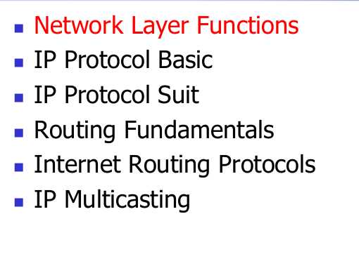

---

## 本节内容

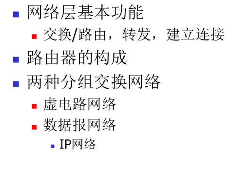

---

## 传输层的功能

- 从发送到接收主机传输段
- 在发送端，将段封装为数据报
- 在接收端，将段传送到传输层
- 每个主机、路由器中的网络层协议
- 路由器检查通过它的所有IP数据报中的报头字段

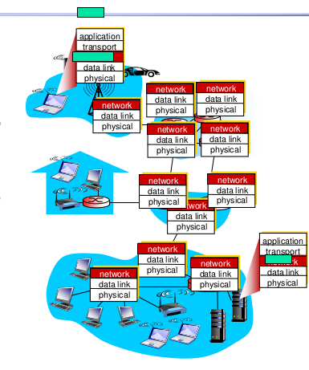

### 两个主要功能：转发(forwarding)和路由选择（routing/switching）

转发：将分组从一个输入链路接口转移到适当的输出链路接口的路由器本地动作。（错误处理、排队和调度）

重点：转发表（forwarding table）

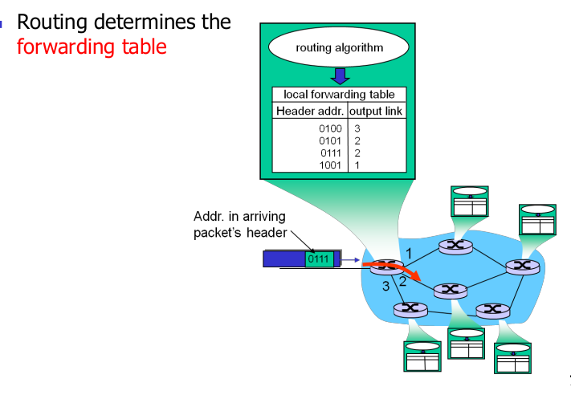

Queuing and scheduling:

- Host to Switch
- Switch to Host
- Switch to Switch

路由选择：确定分组从源到目的地所采取的端到端路径的网络范围处理过程。（最短路径，寻路算法）

---

### **连接建立（Connection Setup）**

在网络体系结构中，某些网络（如 **ATM、帧中继（Frame Relay）、X.25**）要求在数据传输前，**两端主机和途经的路由器** 先建立 **虚拟连接（Virtual Connection）**。

#### **关键概念**

1. **网络层 vs 传输层连接服务**
   - **网络层连接（Network-layer Connection）**
     - 在 **两台主机之间** 建立（可能涉及中间路由器的参与，如虚电路 **VCs**）。
     - **示例**：ATM 的虚电路（Virtual Circuit, VC）、MPLS 标签交换路径（LSP）。
   - **传输层连接（Transport-layer Connection）**
     - 在 **两个进程之间** 建立（如 TCP 连接）。
     - **示例**：TCP 的三次握手（SYN-SYN/ACK-ACK）。
2. **路由器在连接建立中的作用**
   - **面向连接的网络（如 ATM）**：路由器需维护 **连接状态表**，记录虚电路标识符（VCI/VPI）和转发规则。
   - **无连接网络（如 IP）**：路由器不感知端到端连接，仅根据目的 IP 逐跳转发。

### **为什么现代互联网主要采用无连接（IP）？**

1. **可扩展性**：
   - 无连接网络（IP）无需维护每流状态，适合超大规模网络。
2. **容错性**：
   - 如果某路由器故障，IP 可动态选择新路径，而 VC 需重建连接。
3. **灵活性**：
   - 应用层可自由选择传输协议（如 TCP 可靠传输或 UDP 低延迟）。

---

### **网络服务模型（Network Service Model）**

网络服务模型定义了数据包从发送方到接收方的传输通道（channel）所提供的**服务承诺**，从主机的角度看，这也被称为**服务质量（Quality of Service, QoS）**。

------

### **核心问题**

**Q：网络为数据包传输提供什么样的服务保证？**

#### **1. 针对单个数据包的服务（Per-Packet Services）**

- **可靠交付（Guaranteed Delivery）**
  - 确保数据包最终到达接收方（如通过重传机制）。
- **延迟保证（Bounded Delay）**
  - 例如：保证数据包端到端延迟 `< 40ms`（对实时音视频关键）。
- **丢包率限制（Loss Rate Guarantee）**
  - 例如：丢包率 `< 0.1%`。

#### **2. 针对数据流（Flow）的服务（Per-Flow Services）**

- **按序交付（In-Order Delivery）**
  - 确保同一流中的数据包按发送顺序到达（如 TCP 要求）。
- **最小带宽保证（Guaranteed Minimum Bandwidth）**
  - 例如：为视频流预留 `5Mbps`，避免被其他流量挤占。
- **抖动控制（Jitter Control）**
  - 限制数据包间隔时间的变化（如 VoIP 要求恒定间隔）。

------

### **常见网络服务模型对比**

| **模型类型**                 | **典型协议** | **服务特点**                             | **适用场景**           |
| ---------------------------- | ------------ | ---------------------------------------- | ---------------------- |
| **尽力而为（Best-Effort）**  | IP/UDP       | 无任何保证，可能丢包、乱序、延迟波动     | 普通网页浏览、文件下载 |
| **可靠服务（Reliable）**     | TCP          | 保证按序交付、无丢包（通过重传）         | 电子邮件、文件传输     |
| **软实时（Soft Real-Time）** | RTP/QUIC     | 部分 QoS（如低延迟优先），但不严格保证   | 视频会议、在线游戏     |
| **硬实时（Hard Real-Time）** | ATM CBR      | 严格保证带宽、延迟、抖动（通过资源预留） | 传统电话网络、工业控制 |

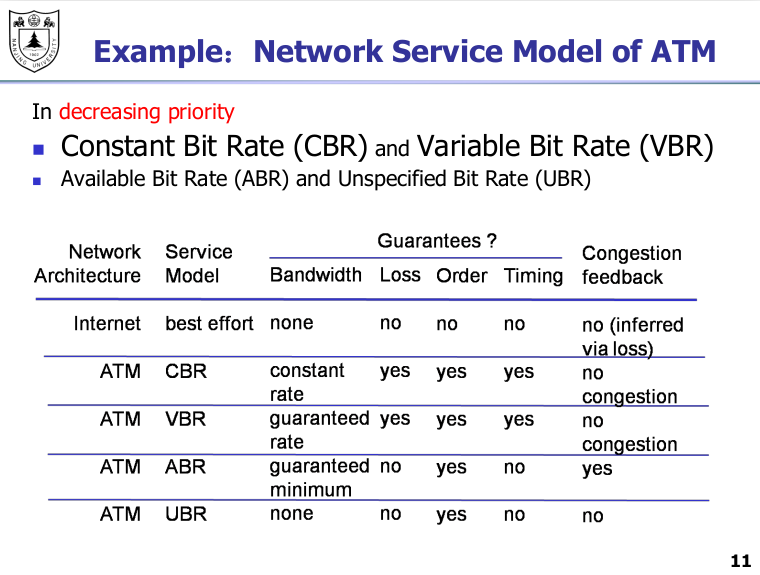

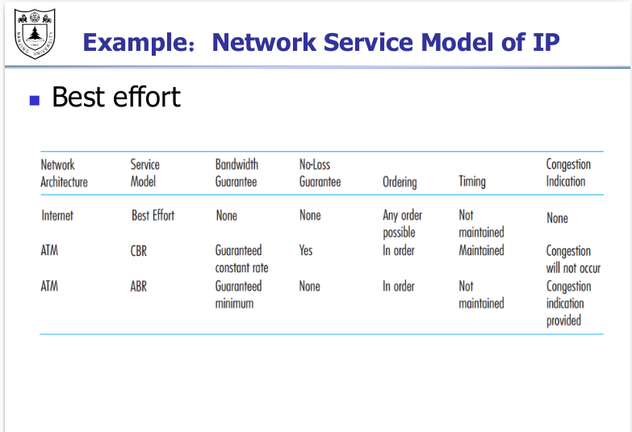

---

IP routers（IP路由器）

- 路由器容量=N x R
  - N=外部路由器“端口”的数量
  - R=端口的速度（“线速率”）

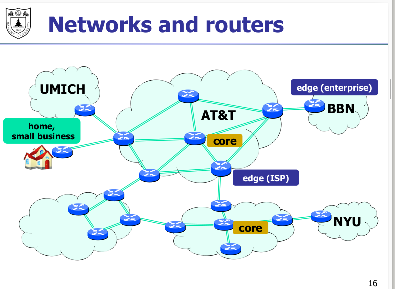

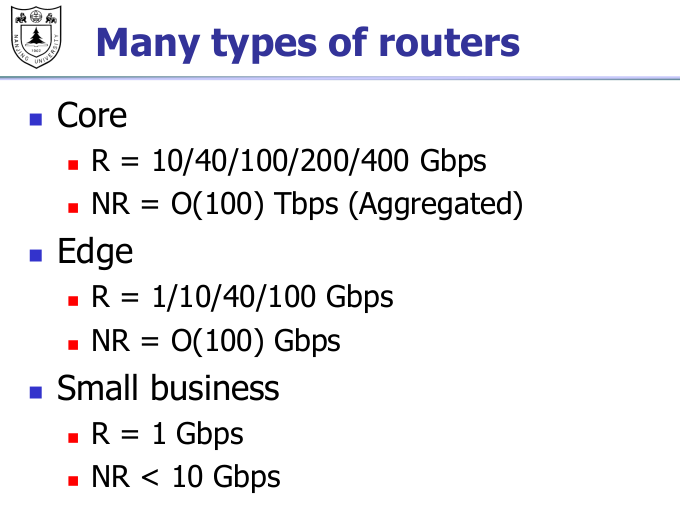

### 路由器内部：工程视角

Two key switch functions:

-  Run routing algorithms/protocol
-  Forwarding packets from incoming to outgoing link

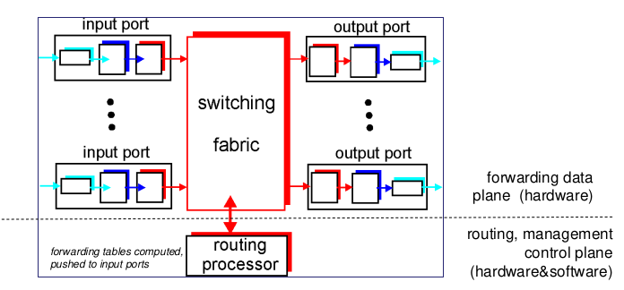

### 输入端口功能

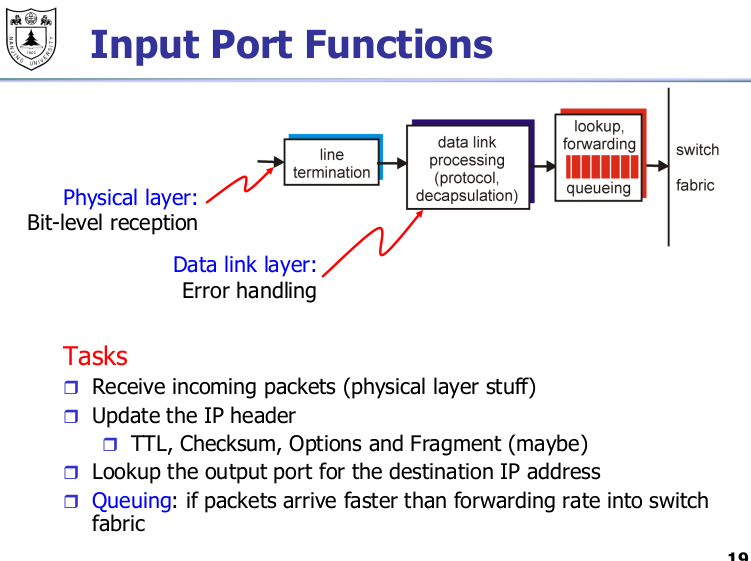

### **挑战：高速处理需求**

在高速网络环境下，路由器需以极低延迟处理数据包，这对硬件设计提出了严苛要求。

#### **典型场景**

- **数据包大小**：100字节
- **链路速率**：40 Gbps
- **包到达间隔**：**每20纳秒（ns）一个新包**

- 路由器必须在 **20ns 内** 完成单包的完整处理（解析、查表、转发）。
- 若超时，会导致队列堆积或丢包。

### **解决方案：专用硬件加速**

####  网络处理器（ASIC/NPU）

- **功能**：
  - 通过定制化集成电路（ASIC）实现 **线速处理**，避免通用CPU的指令延迟。
  - 并行处理多个数据包流水线（Pipeline）。
- **典型优化**：
  - **查表加速**：使用TCAM（三态内容寻址存储器）实现纳秒级路由匹配。
  - **CRC/校验和卸载**：由硬件模块直接计算，无需CPU介入。

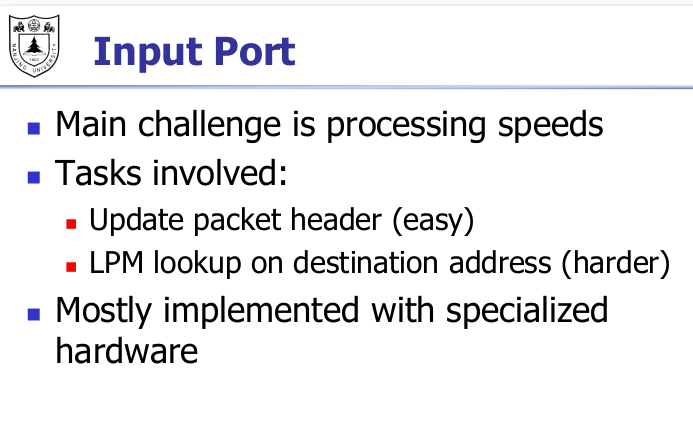

---

### 查找输出端口

- One entry for each address → 4 billion entries!
-  For scalability, addresses are aggregated

#### 策略：最长路径匹配

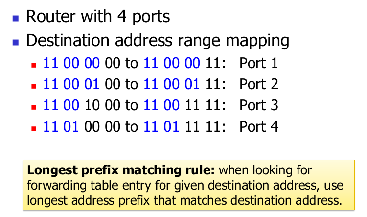

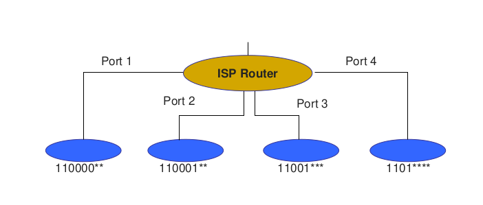

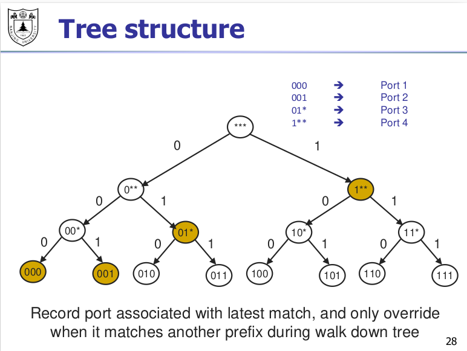

---

### 输出端口功能

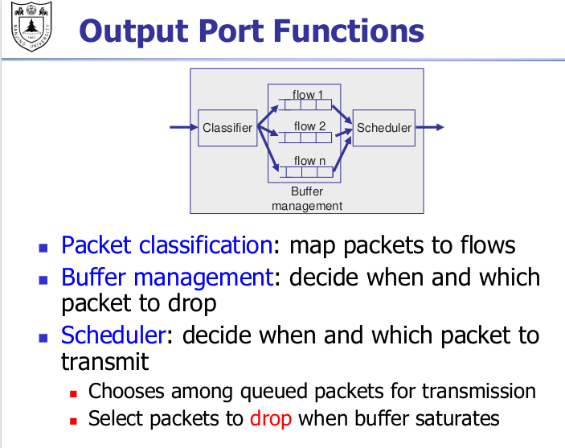

### （*）最简单的：FIFO

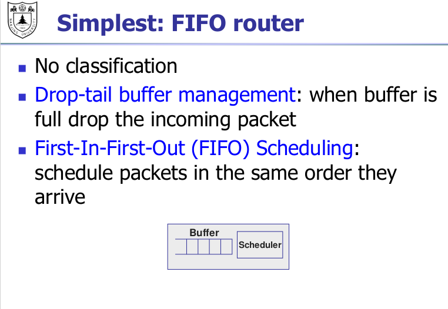

---

### **数据包分类（Packet Classification）**

#### **核心问题**

路由器需要基于**数据包头部的多个字段**，快速将数据包划分到不同的**流（Flow）\**或\**服务类别（Class）**，以实现：

- **流量管理（QoS）**：如优先处理 VoIP 流量
- **安全策略（ACL）**：如阻止特定源 IP 的访问
- **负载均衡**：如按五元组哈希分流

------

### **分类依据的关键字段**

| **字段**             | **长度** | **示例匹配规则**            |
| -------------------- | -------- | --------------------------- |
| 源 IP 地址           | 32 bit   | `192.168.1.0/24`            |
| 目的 IP 地址         | 32 bit   | `10.0.0.1`                  |
| 源端口（TCP/UDP）    | 16 bit   | `80-443`（HTTP/HTTPS 范围） |
| 目的端口（TCP/UDP）  | 16 bit   | `22`（SSH）                 |
| 协议类型（Protocol） | 8 bit    | `6`（TCP）、`17`（UDP）     |
| 服务类型（TOS/DSCP） | 8 bit    | `0x20`（低延迟标记）        |

**注**：匹配规则通常是**范围**（如端口范围）或**前缀**（如 IP 子网）。

------

### **技术挑战：多维范围搜索**

#### **问题复杂性**

- **维度爆炸**：5 元组（源/目的 IP+端口、协议）组合可能形成数万条规则。
- **交叉匹配**：规则可能重叠（如同时匹配 IP 和端口），需确定最高优先级。
- **线速要求**：40Gbps 链路下需在 **纳秒级** 完成分类（如 100B 包每 20ns 到达）。

#### **示例规则表**

| 优先级 | 源 IP          | 目的端口 | 协议 | 动作     |
| ------ | -------------- | -------- | ---- | -------- |
| 1      | 192.168.1.0/24 | 80-443   | TCP  | 高优先级 |
| 2      | 0.0.0.0/0      | 22       | TCP  | 丢弃     |
| 3      | 10.0.0.1       | 53       | UDP  | 普通队列 |

---

### **调度器（Scheduler）**

调度器是路由器/交换机的核心组件，负责从多个流的队列中选择下一个要发送的数据包，直接影响网络的**公平性、优先级和效率**。

------

## **1. 基本架构：每流独立队列**

- **每流一个队列（Per-Flow Queueing）**
  - 每个流（如TCP连接）维护独立的FIFO队列，避免流间干扰。
  - **示例**：
    - 流A（视频流）：队列中有3个包
    - 流B（网页流量）：队列中有1个包
    - 流C（VoIP）：队列中有2个包

------

## **2. 调度算法的核心目标**

| **目标**       | **说明**                                                     |
| -------------- | ------------------------------------------------------------ |
| **高速度**     | 必须在极短时间内做出调度决策（如40Gbps链路下每20ns处理一个包）。 |
| **公平性**     | 确保各流按权重公平分享带宽（如WFQ）。                        |
| **优先级支持** | 高优先级流（如VoIP）可优先调度，即使其他流有更多数据包。     |
| **低延迟**     | 对延迟敏感流量（如游戏）快速响应。                           |
| **可扩展性**   | 支持大规模流数（如数据中心中数百万条流）。                   |

------

## **3. 经典调度算法对比**

### **(1) 轮询（Round-Robin, RR）**

- **原理**：依次从每个非空队列发送一个包。
- **优点**：简单、无状态。
- **缺点**：
  - 忽略包大小差异，大包流实际占用更多带宽。
  - 无法支持优先级。

**示例**：

- 流A（1500B包）、流B（100B包）→ 流A实际占用15倍带宽。

------

### **(2) 加权公平队列（WFQ）**

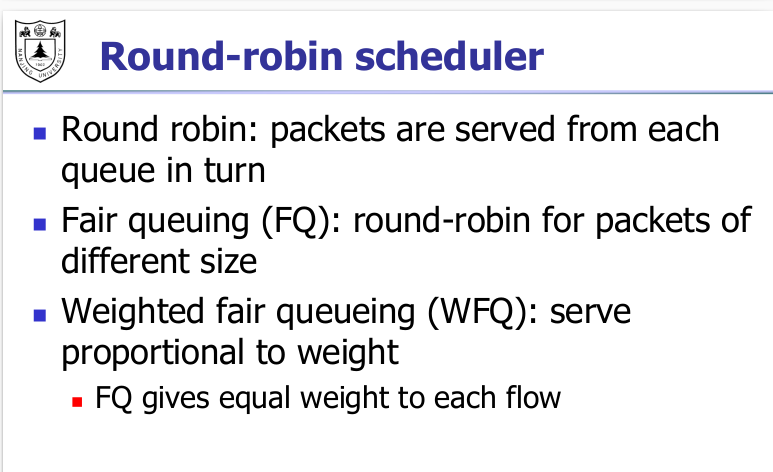

- **原理**：
  - 为每个流分配权重（如VoIP权重=3，下载流权重=1）。
  - 按权重比例分配带宽（类似“比特级轮询”的模拟）。
- **优点**：
  - 严格保障公平性，支持优先级。
  - 长期带宽分配精确符合权重。
- **缺点**：
  - 计算虚拟时间戳（Virtual Finish Time）开销较大。

**示例**：

- 流A（权重=2）、流B（权重=1）→ 流A获得2/3带宽，流B获得1/3。

------

### **(3) 赤字轮询（Deficit Round Robin, DRR）**

- **原理**：
  - 每个流维护一个“信用值”（Deficit Counter）。
  - 每轮调度时，流可发送不超过信用值的数据量。
  - 未用完的信用累积到下一轮。
- **优点**：
  - 近似WFQ的公平性，但计算更简单。
  - 适合硬件实现。
- **缺点**：
  - 突发流量可能导致短期不公平。

**示例**：

- 流A信用=1500B，发送1500B包后信用归零；流B信用=500B，发送300B包后剩余200B累积。

------

### **(4) 优先级队列（Priority Queuing, PQ）**

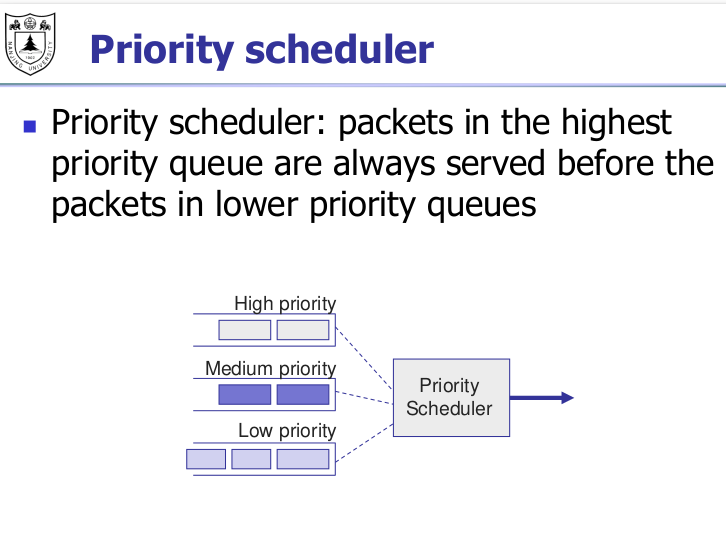

- **原理**：
  - 队列按优先级分层（如高、中、低）。
  - 仅当高优先级队列为空时，才调度低优先级队列。
- **优点**：
  - 绝对保障高优先级流的低延迟。
- **缺点**：
  - 低优先级流可能“饥饿”（长期得不到服务）。

**示例**：

- VoIP（高优先级）始终优先于下载流量（低优先级）。

---

### 交换结构

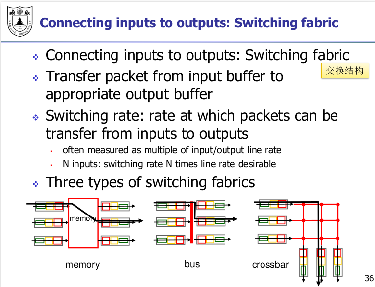

### 连接输入与输出：交换结构（Switching Fabric）

❖ **功能**：将数据包从输入缓冲区传输到对应的输出缓冲区
 ❖ **交换速率（Switching Rate）**：
 ▪ 定义：数据包从输入端口到输出端口的传输速率
 ▪ 通常以输入/输出线路速率的倍数衡量
 ▪ 对于N个输入端口：交换速率需达到线路速率的N倍（理想情况）
 ❖ **三种交换结构类型**：
 ▪ **共享内存（Memory）**：通过中央内存实现数据包交换
 ▪ **总线（Bus）**：所有端口共享一条总线进行数据传输
 ▪ **交叉开关（Crossbar）**：通过交叉点矩阵实现并行无阻塞交换

---

### 基于内存的交换（Switching via Memory）

#### 第一代路由器的实现方式

- **架构原理**：
  - 传统计算机架构，由 **CPU 直接控制交换过程**。
  - 数据包从输入端口复制到 **系统内存**，由 CPU 处理后转发至输出端口。
- 性能限制：
  - 交换速度受限于 **内存带宽**（每个数据包需两次穿越总线：写入内存 + 读取内存）

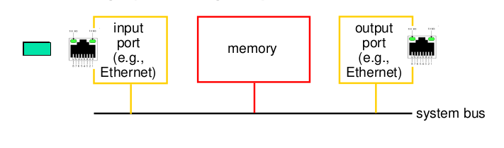

---

### 基于总线的交换（Switching via a Bus）

#### 实现原理

◼ 数据包从 **输入端口内存** 通过 **共享总线（Shared Bus）** 传输至 **输出端口内存**。
 ◼ **性能瓶颈**：

- **总线争用（Bus Contention）**：交换速度受限于总线带宽（同一时间仅允许一个端口使用总线）。

#### 示例与性能指标

❖ **Cisco 5600 路由器**：

- 总线带宽为 **32 Gbps**，可满足 **接入层路由器（Access Router）** 和 **企业级路由器（Enterprise Router）** 的速率需求。

---

### 基于网状互联的交换（Switching via a Mesh）

#### 设计目标

◼ 克服 **总线带宽限制**，实现更高吞吐量的数据交换。

#### 核心技术

❖ **多处理器互联技术迁移**：

- 初始设计用于多处理器互联的 **Banyan 网络**、**交叉开关（Crossbar）** 等拓扑结构，被引入交换领域。
   ❖ **高级数据分片机制**：
- 将数据报（Datagram）分片为 **定长信元（Fixed-Length Cells）**，通过 **交叉开关矩阵** 并行传输，提升交换效率。

#### 性能示例

◼ **Cisco 12000 系列路由器**：

- 通过网状互联结构实现 **60 Gbps** 的交换容量，适用于高密度核心网络场景。

------

## 虚拟电路与数据报网络（Virtual Circuit and Datagram Networks）

### 回忆：电路交换和分组交换（重点)

### 电路交换（Circuit Switching）

#### 核心特性

◼ **端到端资源预留**：

- 为通信会话（Call）预留 **链路带宽** 和 **交换机处理能力**，确保资源独占。
   ◼ **性能保障**：
- 无资源共享，提供 **确定性性能**（如固定延迟、无拥塞）。
   ◼ **连接管理**：
- 需通过 **建立连接（Setup）** 和 **释放连接（Teardown）** 的显式控制流程。

#### 典型应用

❖ 传统电话网络（PSTN）、实时视频传输等对稳定性要求高的场景。

------

### 分组交换（Packet Switching）

#### 核心机制

◼ **数据分片传输**：

- 端到端数据流被划分为 **分组（Packets）**，多个应用（如 A、B）的分组共享网络资源。
   ◼ **存储转发模式**：
- 每个分组逐跳（Hop-by-Hop）传输，在交换机中 **暂存（Queued）** 并排队等待转发。
   ◼ **资源争用与拥塞**：
- 突发流量（Burst Traffic）可能导致 **资源需求超过供给**，引发排队延迟或丢包。

#### 典型应用

❖ 互联网（IP 网络）、电子邮件、文件传输等容忍动态延迟的场景。

---

### 两类分组交换网络

### 虚电路网络（Virtual Circuit Networks）

#### 核心特性

◼ **基于数据流的服务**：

- 网络层提供 **面向连接（Connection-Oriented）** 的服务，为通信流（如文件传输、视频流）建立端到端逻辑链路（虚电路）。
   ◼ **资源预分配**：
- 虚电路建立阶段预留路径资源（如带宽、缓冲区），确保传输可靠性。
   ◼ **路由机制**：
- 数据分组通过 **固定路径（Predefined Path）** 传输，仅需携带虚电路标识符（VCI），交换机基于 VCI 快速转发。

#### 典型应用

❖ **ATM（异步传输模式）**、**X.25**、**帧中继（Frame Relay）**，适用于需稳定 QoS 的企业专网或传统广域网。

------

### 数据报网络（Datagram Networks）

#### 核心特性

◼ **基于单分组的服务**：

- 网络层提供 **无连接（Connectionless）** 服务，每个分组独立路由，无需预先建立连接。
   ◼ **动态资源分配**：
- 分组根据实时网络状态选择路径，资源按需竞争，灵活性高但可能引发拥塞。
   ◼ **路由机制**：
- 每个分组携带完整目标地址，交换机基于路由表逐跳转发，路径可能动态变化。

#### 典型应用

❖ **IP 网络**（如互联网）、UDP 数据传输，适用于容忍延迟波动、强调灵活性的场景（如网页浏览、即时通信）。

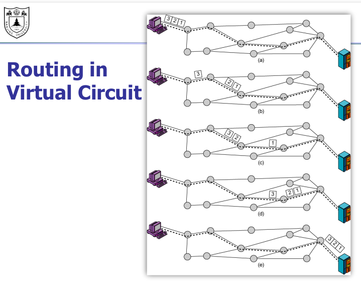

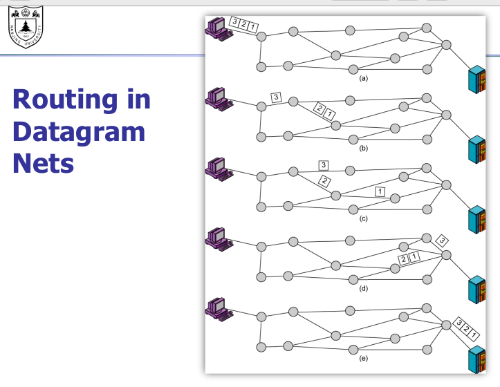

---

### 虚电路网络

- **为每个数据流建立和拆除连接**
-   每个分组携带虚电路标识符（而非目标主机地址）
-   源到目标路径上的每个交换机为每条经过的连接维护“状态”
-  链路及交换机的资源（带宽、缓冲区）可分配给虚电路
  -   专用资源 = 可预测的服务质量

### 连接建立

-  虚电路网络的核心功能
  -  例如：ATM、帧中继、X.25 等协议
-  两个端主机及路径中的交换机需预先为虚连接建立路径
-  通过路由选择寻找合适（最短）路径

### 虚电路实现

- **虚电路的组成包括**

  - 从源端到目的端的路径

  - 虚电路编号（路径上的每条链路可能分配一个编号）

  - 路径上各交换机转发表中的条目

-  **关键说明**

  - 属于虚电路的分组携带虚电路编号（而非地址）

  - 虚电路编号在每条链路上可更改，转发表中记录新的虚电路编号

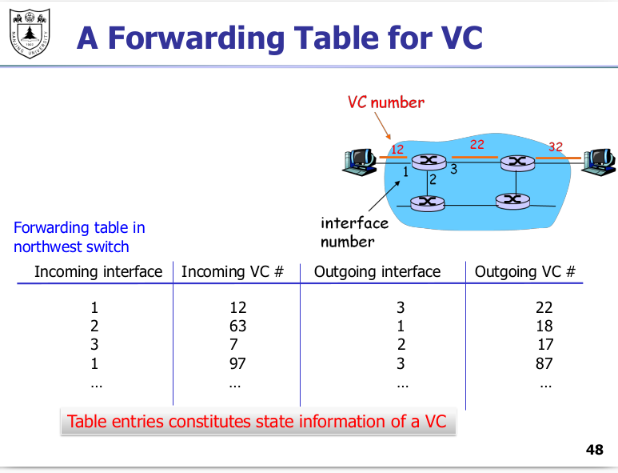

---

### 数据报网络

-  **网络层无需建立呼叫连接**

  - 网络层不存在“连接”概念

  - 交换机不维护端到端连接的状态信息

- **数据包通过目的主机地址进行转发**
  - 同一源-目的对的数据包可能通过不同路径传输

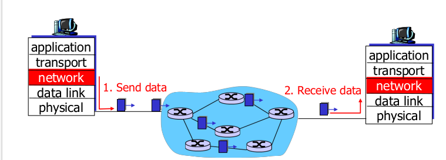

### 数据报网络的转发表

（也称为路由表）

-  条目数量可能高达 40 亿
-  目的地址前缀可能对应交换机地址或子网地址

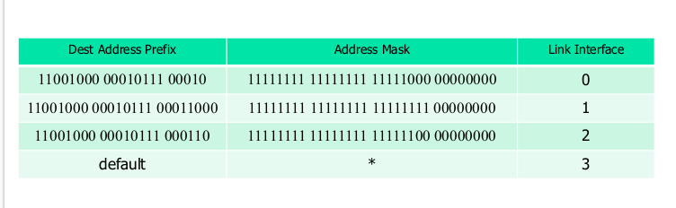

---

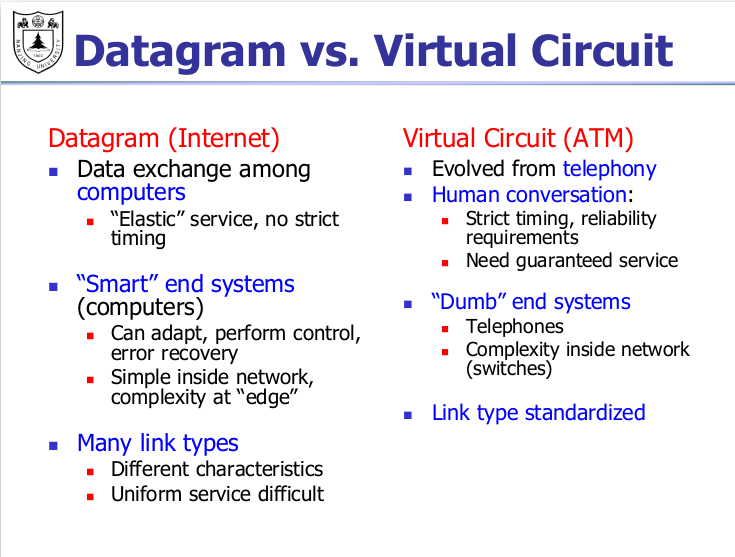

