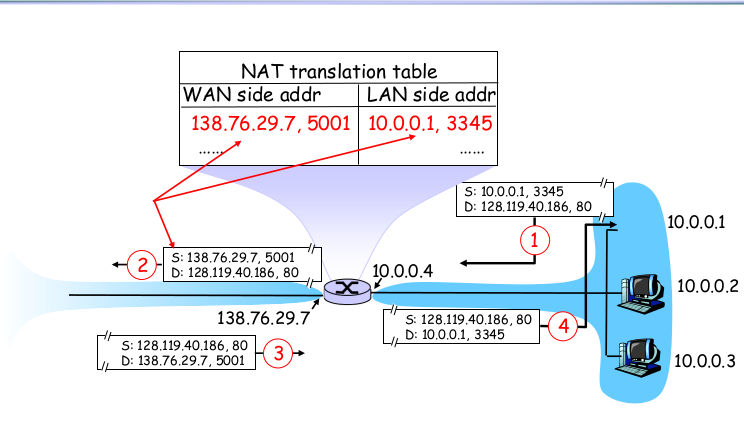

# CH4-3

网络地址=IP地址和子网掩码进行与运算

网络地址=主机号全0的IP地址（有地址分类型和CIDR灵活型）

子网内第一个可用IP地址就是网络地址的后一位，一般被设为网关（网关也可能是别的IP）

直接广播地址=主机号全1的IP地址

255.255.255.255：受限广播地址

IP地址用来唯一标识互联网中的一个网络或一台主机

网络号全0,主机号确定：当前这个网络的特定主机

网关（gateway）：完成不同网络协议转换的设备（通常指路由器的IP）

网络地址不同，就在不同的网络（子网）里，实现两个网络之间的通信必须经过网关

一台主机如果找不到可用的网关，就把数据包发给默认指定的网关。

DNS:主机名转换为IP地址

大范围子网（理论上）可以ping通小范围子网

---

## IP协议簇

---

## 网络地址转换NAT（Network address translation）

**NAT**

-  为内部和外部流量启用不同的IP地址集。
-  IP地址转换发生在内网与外部互联网的接口处。
- **主要用途**
  -  通过隐藏内部IP地址实现防火墙功能。
  -  允许企业（或组织）使用更多内部IP地址。
  -  隔离组织/ISP的网络变更影响。

### 三种NAT类型

- **静态NAT**
  -  一个私有IP地址（不同局域网内的内网IP可以重复使用）映射到一个预留的公有IP地址。
  -  通常用于内网中的服务器主机。
- **动态NAT**
  -  NAT路由器维护一个注册IP地址池，按需分配给私有IP地址。
  -  通常用于内网中的客户端PC。
- **单地址**
  - **NAT/过载/伪装/网络地址端口转换（NAPT）**

**子网可以存在于内网中**：例如，一个公司内网（如`10.0.0.0/8`）可能划分为多个子网（如`10.1.0.0/16`为总部，`10.2.0.0/16`为分支机构）。

**内网可以包含多个子网**：通过路由器或三层交换机连接不同子网，实现内网互通。

---

## ICMP(Internet Control Message Protocol)

ping通过ICMP完成

- 互联网控制报文协议（RFC 792）

-  在路由器和主机之间传输错误与控制消息
  -   通过**回显请求与应答**支持网络诊断（如**ping**命令）
  -  反馈网络问题（例如：生存时间超时、不可达的主机）
- **封装在IP数据报中**
  -  协议类型=1
  -   不可靠传输

### Ping

- 测试目标可达性

-  源主机向远程主机或路由器发送**回显请求（echo request）**

-   若目标系统收到ICMP报文，则向源主机返回**回显应答（echo reply）**

-   Ping工具可进一步实现：

  - 计算往返时间（Round-Trip Time）

  - 统计到目标的跳数（基于TTL值推算）

### Traceroute

- 测量到达目标所需的跳数
-   源主机发送**首个IP（UDP）数据包**，TTL值设为1
-   第一个路由器将TTL减至0，丢弃包并返回**TTL超时**消息
-   源主机计算往返时间（RTT），并重复3次
-   源主机发送**第二个IP数据包**，TTL值设为2
-   第二个路由器返回TTL超时消息
-   源主机计算RTT，并重复3次
-   源主机逐步增加TTL值并重复上述过程，直至到达目标（或触发**主机不可达**）
-   可能受动态路由影响

### Path MTU

-  确定到达目标路径中的**最小MTU**
-   源主机发送一个**大型IP数据包**（设置“不分片”标志位）
-   若数据包过大，相关路由器将返回**参数错误（Fragmentation Needed）**消息
-   源主机根据反馈减小数据包长度并重试
-   重复上述步骤，直至数据包无ICMP错误到达目标
-   同样可能受动态路由影响

---

## Mobile IP(移动IP)

### 移动IP的需求背景

-  数据报通过路由器在不同网络间转发，依赖**目的IP地址**进行路由
-   IP地址由两部分组成：**网络标识（netID） + 主机标识（hostID）**
-   互联网上的大多数应用基于**TCP连接**实现

- TCP依赖IP地址和端口号进行路由与数据交付

-   **移动设备切换网络时，其IP地址会动态变化**

- 每次网络切换，TCP连接需中断并重新建立通信
-   **移动IP的目标**：解决IP地址动态变化导致的通信中断问题

- 无需修改TCP协议，使移动设备的IP地址**在逻辑上维持固定**

------

### 移动IP的核心实体

#### 1.  移动节点（Mobile Node)

-  能够在不同网络间切换连接的主机（如手机、笔记本电脑）
-  IP地址因网络切换动态变化，但通过移动IP机制保持通信连续性

#### 2. 归属代理（Home Agent）

-  位于移动节点**家乡网络**的路由器或服务器

-   核心功能：

  - 维护移动节点的**注册信息**（如当前转交地址）

  - 拦截发往移动节点家乡地址的数据包，通过**隧道封装**转发至其当前位置

  - 处理移动节点的绑定更新请求

#### 3. 外部代理（Foreign Agent）

-  位于移动节点**访问的外地网络**的路由器或服务器

-  核心功能：

  - 为移动节点提供**转交地址（Care-of Address）**

  - 解封装来自家乡代理的隧道数据包，并传递给移动节点

  - 协助管理移动节点在外地网络的注册与注销

#### 4.  通信节点（Correspondent Node）

-  与移动节点通信的任意主机或服务器
-   无需感知移动节点的位置变化，直接使用其**家乡地址**进行通信

---

---

### Mobile IP协议能力:Discovery,Registration,Tunneling(重点在Tunneling)

#### 发现

-  移动（外部）代理
  -  定期发送携带移动代理通告扩展的 **ICMP 路由器通告**，以声明自身存在
-  移动节点
  -  可选择主动向代理请求发送通告
  -  或仅等待下一次通告

**注册**

- **移动节点**
  -  从外部代理获取 **转交地址**
  -   请求其归属代理将数据包转发至外部代理
- **4 个步骤**
-  移动节点向外部代理发送注册请求
-  外部代理将此请求中继至归属代理
-  归属代理向外部代理发送注册回复
-   外部代理将此回复中继至移动节点

---

### 隧道

-  注册完成后，建立 **IP 隧道**
  -  隧道位于 **归属代理** 与移动节点的 **转交地址** 之间
  -  归属代理广播 **免费 ARP 请求**，将移动节点的 IP 地址绑定到归属代理的 MAC 地址
  -  由此，归属代理接收发送至移动节点的数据包，并通过 IP 隧道将数据包转发至外部代理
-  对于 **通信节点**
  -  假设来自移动节点的回复仍源自其归属网络
  -   继续将数据包发送至归属代理
-  从而在不改变移动节点 IP 地址的情况下维持 TCP 连接

### 双重报文头

---

## IPv6

- **初始动机**：地址空间耗尽
  -  网络与互联网的快速增长
  -   32位地址空间（尤其是网络地址）即将被完全分配
- **额外动机**
  -  新头部格式提升处理与转发速度
  -   头部改动便于实现 **QoS**(服务质量)
  -   路由器不进行分片
  - **新地址模式**：路由至多个复制服务器中的“最佳”节点

### IPv6报文头

- 版本（4bits）：置6
- 流量类型（8bits）:和IPv4的TOS（服务类型）一样的
- 流标签（20bits）:标识一条数据报的流，能够对一条流中的某些数据报给出优先权，或者用来对来自某些应用的数据报给出更高的优先权
- 有效载荷长度（16bits）:无符号整数，标记跟在定长的40字节数据首部后面的字节数量
- 下一个首部（8bits）:使用与IPv4首部中协议字段相同的值
- 源/目的地址（128bits）
- 数据

流量类型

-  IPv6 头部中的 **8 位字段**，可供 **源节点** 和/或 **转发路由器** 用于标识和区分 IPv6 数据包的 **不同类别或优先级**。
-  例如：用作 **DiffServ** 中的码点
- **通用要求**
  -  服务接口必须提供方法，使上层协议可指定流量类别的值
  -   流量类别的值可能被源节点、转发节点或接收节点修改
  -   上层协议不应假设数据包中的流量类别值未被更改

**IPv6 流**

-  从特定源到特定目的地的 **数据包序列**
- **从主机视角看**
  -  源自单一应用且具有相同的传输服务需求
  -  可能包含 **单个或多个 TCP 连接**
  -  一个应用可能生成单个流或多个流
- **从路由器视角看**
  -  共享影响路由器处理方式的属性
  -  例如：路由选择、资源分配、丢弃规则、计费及安全策略

**流标签**

-  一个流由以下组合 **唯一标识**：
  -   源地址和目的地址
  -   **20 位非零流标签**
-  流的各项要求在流 **启动前定义**
  -  随后为流分配唯一的流标签
- **路由器** 通过以下方式决定数据包的路由与处理：
  -  直接查表（无需检查头部其他字段）中与流标签对应的规则

**扩展头部**

**出现顺序**

-   **逐跳选项**：需在每个路由器处理
-   **路由**：源路由
-   **分片**：源端分片
-   **认证**
-   **封装安全载荷**
- **目的选项**：由目的地节点处理

**分片**

- **IPv6 路由器不对数据包进行分片**
  -  核心网络的数据包处理更高效
  -   分片由 **源主机** 完成
-  若数据包超出下一跳 MTU（最大传输单元）：
  -  返回 **“数据包过大”** 错误消息
  -  此消息通过 **ICMPv6** 传递
  -  过滤 ICMPv6 消息可能导致通信问题（例如路径 MTU 发现失效）

**广播**

- **IPv6 无广播**
-  使用 **“所有节点”组播组**（地址：**ff02::1**）替代
- **广播的缺点**：
  -   会唤醒所有节点（即使仅需少量设备响应）
  -   可能引发 **广播风暴**（网络拥塞风险）

**邻居发现**

- **IPv6 无 ARP**（地址解析协议）
-  替代机制为 **邻居发现协议**（Neighbor Discovery）
- **实现方式**
  -   基于 **ICMPv6**
  -   使用 **组播** 通信
- **功能**
  -   地址解析（将 IPv6 地址映射为 MAC 地址）
  -  发现相邻路由器
  -  跟踪邻居地址变化
  -  检测邻居可达性
  -  执行 **重复地址检测**（DAD）

**IPv6 地址**

- **地址长度**
  -  ◼ 128 位，分配给接口
- 示例地址格式：
- FEDC:BA98:7654:3210:FEDC:BA98:7654:3210
- 1080:0:0:0:8:800:200C:417A
- **特性**
  -   单个接口可配置 **多个单播地址**
- **地址类型**
  -  **单播**（Unicast）
  -  **组播**（Multicast）
  -  **任播**（Anycast）

**IPv6 地址示例**

- **地址类型**
  -  **单播地址**
    -   **1080::8:800:200C:417A**（简化自 **1080:0:0:0:8:800:200C:417A**）
  -  **组播地址**
    -  **FF01::101**（简化自 **FF01:0:0:0:0:0:0:101**）
  -  **环回地址**
    -  **::1**（简化自 **0:0:0:0:0:0:0:1**）
  -  **未指定地址**
    -  **::**（简化自 **0:0:0:0:0:0:0:0**）
- **IPv4 地址嵌入 IPv6**
-   两种表示方式：
-   **直接嵌入**：**x:x:x:x:x:x:d.d.d.d**
  -   示例：**::13.1.68.3**（简化自 **0:0:0:0:0:0:13.1.68.3**）
-  **IPv4 映射地址**：**::FFFF:d.d.d.d**
  -   示例：**::FFFF:129.144.52.38**（简化自 **0:0:0:0:0:FFFF:129.144.52.38**）

---

**IPv6 相较于 IPv4 的优势**

- **扩展的地址能力**
  -   **128 位地址空间**（IPv4 为 32 位）
  -   **组播地址扩展**（支持更高效的组播通信）
  -   **任播**（数据包可送达一组节点中的最近成员）
  -   **地址自动配置**（支持无状态地址分配）
- **改进的选项机制**
  -   引入 **独立可选扩展头部**（位于 IPv6 头部与传输层头部之间）
  -   中间路由器通常无需处理扩展头部（提升转发效率）
  -  更易扩展新功能（如未来协议升级）
  -  **移除校验和字段**（减少路由器处理开销）
- **资源分配支持**
  -   通过 **流量类别字段**（Traffic Class）标识优先级
  -   支持 **流标签**（Flow Label）标记特定数据流（如实时视频）
  -  可基于 QoS（服务质量）提供差异化传输（非“尽力而为”模式）
- **增强移动性与安全性**
  -  更高效的 **移动 IPv6 机制**（减少切换延迟）
  -  **原生安全性支持**
  -  内置 **IPsec**（提供端到端加密与身份验证）

**IPv4 向 IPv6 的过渡技术**

- **背景**

  -   网络设备无法一次性全面升级支持 IPv6

  -  需兼容 IPv4 与 IPv6 混合网络环境

-  **核心过渡方案**

  -   **双协议栈（Dual Stack）**

    -  路由器同时支持 IPv4 和 IPv6 协议栈

    -   根据目标地址自动选择协议版本（如与 IPv6 节点通信时使用 IPv6，与 IPv4 节点通信时使用 IPv4）

      

    -  **隧道技术（Tunneling）**
        **功能**：在 IPv4 网络中封装传输 IPv6 数据包
        **实现方式**：

  - 入口路由器将 IPv6 数据包封装为 IPv4 载荷（类似“包裹套包裹”）

     IPv4 网络传输至出口路由器后解封装，恢复 IPv6 数据包

---

